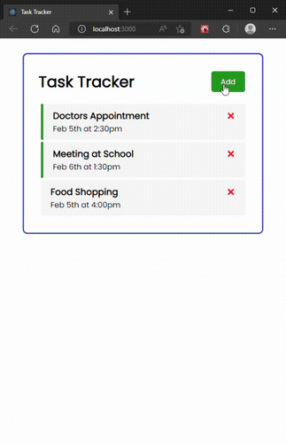

# Task Tracker App

<p align="center">
    
</p>

Project made with the purpose of learning more about React. With this web app you can create whatever tasks you need to be reminded throughout the week. Working with a mock back-end server, tasks created won't get lost when you come back, as well, deleted tasks, will remain deleted.

## Usage

App made in React with a mock api using [json-server](https://www.npmjs.com/package/json-server).

### Install dependencies

```
npm install
```

### Run mock back-end server (http://localhost:3500)

```
npm run server
```

### Run React dev server (http://localhost:3000)

```
npm start
```
